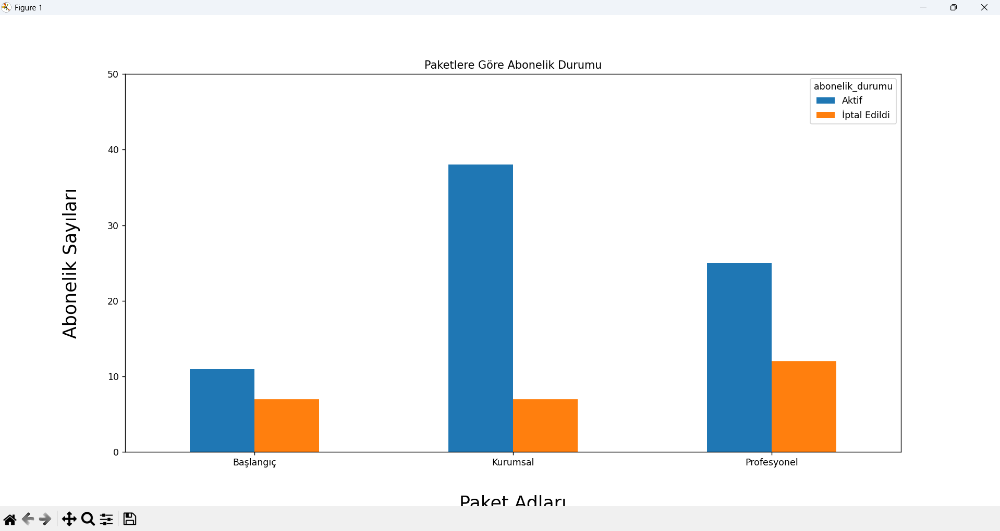
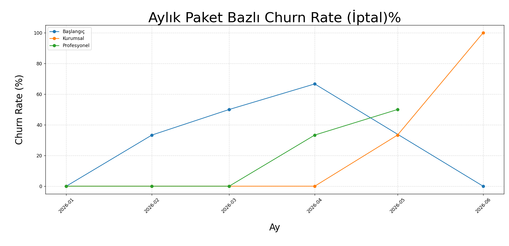
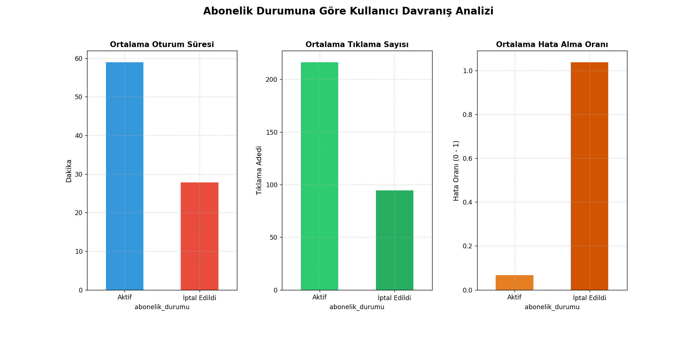

# 📊 Kullanıcı Davranış ve Churn (Abonelik Terk) Analizi

Bu projede, 3 farklı sayfadan oluşan bir e-ticaret/abonelik veri seti işlenerek aktif kullanıcılar ile aboneliğini iptal eden kullanıcıların davranışsal farkları, paket tercihleri ve zaman içindeki churn (abonelik iptali) eğilimleri analiz edilmiştir.

---

## 📂 Veri Altyapısı ve Excel Yapısı

Analizde kullanılan `veri6.xlsx` dosyası 3 ilişkisel sheet’ten oluşmaktadır:

1. **kullanıcılar:** Kullanıcıların demografik bilgileri ve kullanıcı ID’leri  
2. **abonelikler:**  
   - `kullanici_id`  
   - `paket_adi`  
   - `baslangic_tarihi`  
   - `bitis_tarihi`  
   - `abonelik_durumu`  
3. **uaktivite:**  
   - `oturum_suresi_dk`  
   - `tiklama_sayisi`  
   - `hata_aldi_mi`  

---

## ⚙️ Kod Analizleri ve Teknik İyileştirmeler

---

### 1. Genel Durum ve Paket Dağılımı Analizi (`veri6.py`)

Bu analizde `abonelikler` tablosu kullanılarak genel aktif/iptal dağılımı incelenmiş ve paket bazlı kullanıcı dağılımı analiz edilmiştir.

#### 📊 Görseller

#### 📌 Sonuç ve Analiz
- Kullanıcı kitlesi ağırlıklı olarak Kurumsal ve Profesyonel paketlerde yoğunlaşmaktadır.
- Profesyonel paket segmentinde iptal oranı diğer paketlere kıyasla daha yüksektir.
- Bu durum paket beklentisi, fiyatlandırma veya ürün değer algısı ile ilişkili olabilir.

---

### 2. Zaman Serisi Churn Analizi (`veri7.py`)

Kullanıcıların başlangıç ve bitiş tarihleri datetime formatına çevrilerek aylık churn trendi çıkarılmıştır.

#### 📊 Görsel

#### 📌 Sonuç ve Analiz
- Kurumsal paket genel olarak stabil bir yapı göstermektedir ancak bazı dönemlerde ani churn artışları gözlemlenmiştir.
- Başlangıç paketi belirli aylarda yüksek churn oranlarına ulaşarak kullanıcı tutundurma problemlerine işaret etmektedir.
- Genel olarak churn oranlarında dönemsel dalgalanmalar bulunmaktadır.

---

### 3. Kullanıcı Davranış Analizi (`veri8.py`)

`abonelikler` ve `uaktivite` tabloları `kullanici_id` üzerinden birleştirilerek aktif ve iptal eden kullanıcıların davranışları karşılaştırılmıştır.

Matplotlib kullanılarak metrikler farklı ölçeklerde olduğu için subplot yapısı uygulanmış ve her metrik ayrı eksende görselleştirilmiştir.

#### 📊 Görsel

#### 📌 Sonuç ve Analiz
- İptal eden kullanıcıların ortalama oturum süresi ve tıklama sayısı aktif kullanıcılara göre belirgin şekilde daha düşüktür.
- Kullanıcı etkileşimi azaldıkça churn ihtimali artmaktadır.
- Hata sayısı, iptal eden kullanıcı grubunda daha yüksektir.

---

## 📊 Genel Çıkarımlar

- Kullanıcı etkileşimi (oturum süresi ve tıklama sayısı) churn davranışı ile güçlü şekilde ilişkilidir.
- Hata sayısındaki artış kullanıcı deneyimini olumsuz etkileyerek churn riskini artırmaktadır.
- Paket bazlı farklılıklar kullanıcı beklentilerinin segmentlere göre değiştiğini göstermektedir.
- Düşük etkileşim + yüksek hata kombinasyonu churn için kritik bir sinyaldir.

---

## 💡 İşe Dönük Öneriler

- Yüksek hata alan kullanıcı segmentleri için teknik iyileştirmeler yapılmalıdır.
- Düşük etkileşim gösteren kullanıcılar için yeniden aktivasyon stratejileri uygulanabilir.
- Paket bazlı kullanıcı beklentileri analiz edilerek ürün/paket optimizasyonu yapılabilir.
- Profesyonel paket için değer önerisi yeniden değerlendirilebilir.

---

## 🛠️ Kullanılan Teknolojiler

- Python 3.x  
- Pandas  
  - Excel veri okuma  
  - merge ile veri birleştirme  
  - groupby ile segment analizi  
  - datetime dönüşümleri  
- Matplotlib  
  - Bar, pie, line chart  
  - Subplot ile çoklu metrik görselleştirme  

---

## 📌 Sonuç

Bu çalışma, abonelik tabanlı bir platformda kullanıcı davranışlarının churn üzerindeki etkisini analiz ederek kullanıcı kaybını etkileyen temel davranışsal ve operasyonel faktörleri ortaya koymaktadır.

Elde edilen bulgular, ürün geliştirme ve kullanıcı deneyimi iyileştirme süreçleri için veri odaklı bir bakış açısı sunmaktadır.
